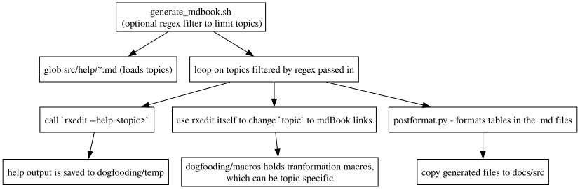

## DON'T MODIFY docs/src/*.md files.  

`generate_mdbook.sh` does that and accepts an optional regex filter to limit the topics to process.

ex:  `generate_mdbook.sh 'more|less'` will only regenerate `docs/src/commands/less.md` and `docs/src/commands/more.md`

This also a case where rxedit is able to do most of the work to transform the raw output of a `rxedit --help <topic>` call to a format compatible with mdBook, including cross-linking to other pages in the doc.

#### Files used to generate mdBook

````
dogfooding
├── fixtablefmt.py                        # some postprocessing in Python, right now limited to formatting markdown tables.
├── generate_mkbook.sh
├── macros
│   ├── _change.rxi												# for each '`<topic>`' has a transform to '[<topic>](./<topic>.md)'
│   ├── _show.rxi													# show all '`<topic>`' - the backticks are important here
│   ├── about.postchange.rxi							# postprocessing specific to `about.md`
│   └── sample.postchange.rxi             # postprocessing specific to `sample.md` (puts in code block ``` quotes)
├── README.md
└── temp                                  # a work directory
    ├── _imtempdir                        # guard file indicating its the working directory
````




